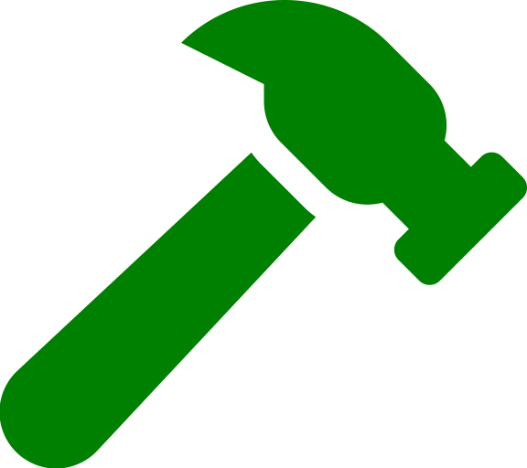

# About Stoplight
Stoplight is a collaborative API design platform that integrates seamlessly into your existing workflows to enable all stakeholders working with APIs to be more productive.

  

# Our Core Values
At Stoplight, we ground ourselves around three guiding principles that unite us. We do our best work when we’re empowered, collaborative, and moving forward with positive intent.

* ##  Be An Owner
  When we see an opportunity to make an impact, we seize it.

* ##  Build Together
  We trust in each other to add value and solve problems through teamwork.

* ##  Practice Mindfulness
  We seek to understand by listening, inquiring, and responding thoughtfully.

# Mission

We believe in a design-first approach to API development, so we created products that provide a means for design-first development. Developing good design-first practices will minimize future costs, speed up your time to market and lead to more consistent, higher quality microservice and IoT applications.

  

# Community Impact

At Stoplight, we believe the positive impact we can make on the world isn’t limited to the API space. APIs are all about connection, and at Stoplight we like to apply that connection to the community as well. Here are the community pillars we support:

* **Diversity and Inclusion in STEM**- Fueling the next generation of tech talents means supporting STEM-based education nonprofits and efforts to create a more equitable and inclusive tech pipeline.
* **Environmental Impact** - We work with organizations like Ecologi, Urban Roots, and OSMI. Check out our Ecologi Forest to learn how we offset the carbon footprint of every Stoplight employee and become a climate positive workforce.
* **Open Source Contributions** - We believe in benefiting the entire developer community, which is why we offer open-source tools to meet your API mocking, linting, and documentation needs. Any and all are welcome to utilize these complementary tools, add to them, and be a part of the community. [Learn More](https://stoplight.io/open-source/)

